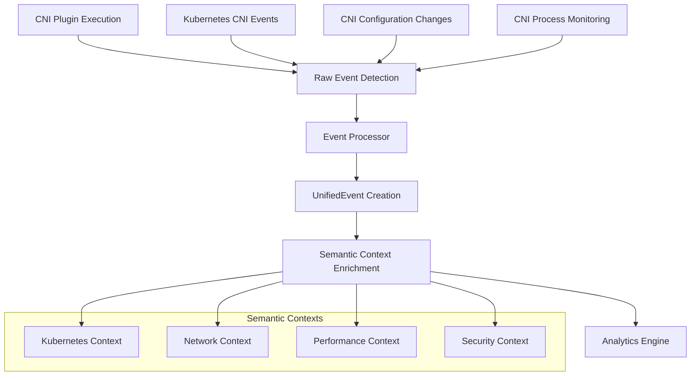

# CNI Collector

The CNI (Container Network Interface) Collector monitors container networking operations and produces rich semantic correlation events for the Tapio observability platform.

## Overview

Container networking is critical for Kubernetes workloads, but troubleshooting network issues requires correlating events across multiple layers - from CNI plugin execution to Kubernetes API events to application-level network failures. The CNI collector bridges this gap by providing unified observability into all CNI operations.

### Key Features

- **Multi-Plugin Support**: Monitors Cilium, Calico, Flannel, AWS VPC CNI, Azure CNI, GCP CNI, and bridge plugins
- **Rich Semantic Correlation**: Creates UnifiedEvent directly with Kubernetes, Network, Performance, and Security contexts
- **Multiple Monitoring Approaches**: Log parsing, process monitoring, Kubernetes events, and configuration file watching
- **Real-time Processing**: Sub-second event detection and processing
- **Production Ready**: Comprehensive health monitoring, statistics, and error handling

### Architecture Principles

The CNI collector follows Tapio's 5-level hierarchy architecture:

```
Level 0: pkg/domain/          # Core UnifiedEvent types
Level 1: pkg/collectors/cni/  # CNI-specific implementation  
Level 2: pkg/intelligence/    # Analytics and correlation (consumer)
```

This collector produces `UnifiedEvent` directly from sources, eliminating conversion overhead and enabling sophisticated real-time correlation analysis.

## Technical Architecture

### Event Flow



### Core Components

#### 1. CNI Collector (`internal/collector.go`)
- **Purpose**: Orchestrates monitoring and event processing
- **Responsibilities**: 
  - Manages multiple monitor instances
  - Coordinates event processing pipeline
  - Provides health monitoring and statistics
  - Handles lifecycle management (start/stop)

#### 2. Event Processor (`internal/processor.go`)
- **Purpose**: Converts raw CNI events to UnifiedEvent
- **Key Features**:
  - Rich semantic context creation
  - Plugin-specific event interpretation
  - Performance and security correlation
  - Distributed tracing integration

#### 3. Monitors (`internal/monitors.go`)
- **LogMonitor**: Parses CNI plugin logs in real-time
- **ProcessMonitor**: Detects CNI binary executions
- **EventMonitor**: Watches Kubernetes networking events
- **FileMonitor**: Monitors CNI configuration changes

### Event Processing Pipeline

1. **Detection**: Multiple monitors detect CNI operations
2. **Aggregation**: Raw events are aggregated in the collector
3. **Processing**: Events are converted to UnifiedEvent format
4. **Enrichment**: Semantic contexts are added:
   - Kubernetes: Pod, namespace, labels, annotations
   - Network: IP allocation, routing, policies
   - Performance: Latency, success rates, plugin timing
   - Security: Network policies, capabilities
5. **Correlation**: Trace context and correlation IDs
6. **Output**: Ready for analytics engine consumption

## Configuration

### Basic Configuration

```yaml
cni_collector:
  name: "production-cni-collector"
  enabled: true
  event_buffer_size: 1000
  
  # Monitoring approaches
  enable_log_monitoring: true      # Parse CNI plugin logs
  enable_process_monitoring: true  # Monitor CNI executions  
  enable_event_monitoring: true    # Watch K8s events
  enable_file_monitoring: true     # Monitor config changes
  
  # CNI paths
  cni_bin_path: "/opt/cni/bin"
  cni_conf_path: "/etc/cni/net.d"
  
  # Performance tuning
  poll_interval: "5s"
  event_rate_limit: 100
  max_concurrent_watch: 10
  
  # Kubernetes integration
  in_cluster: true
  namespace: ""  # Monitor all namespaces
  
  # Correlation settings
  enable_trace_correlation: true
  correlation_timeout: "30s"
```

### Plugin-Specific Configuration

#### Cilium Configuration
```yaml
cilium_config:
  hubble_endpoint: "localhost:4245"
  enable_flow_monitor: true
  enable_policy_audit: true
```

#### Calico Configuration  
```yaml
calico_config:
  felix_metrics_port: 9091
  enable_bgp_monitor: true
  policy_log_level: "info"
```

#### AWS VPC CNI Configuration
```yaml
aws_vpc_config:
  enable_eni_monitor: true
  region: "us-west-2"
  cluster_name: "production-cluster"
  enable_ipam_metrics: true
```

### Environment Variables

```bash
# CNI paths
TAPIO_CNI_BIN_PATH="/opt/cni/bin"
TAPIO_CNI_CONF_PATH="/etc/cni/net.d"

# Kubernetes
TAPIO_CNI_IN_CLUSTER=true
TAPIO_CNI_KUBECONFIG="/etc/kubernetes/admin.conf"

# Performance
TAPIO_CNI_EVENT_BUFFER_SIZE=1000
TAPIO_CNI_POLL_INTERVAL=5s
```

## Supported CNI Plugins

### Tier 1 Support (Full Feature Set)

#### Cilium
- **Features**: Flow monitoring, policy auditing, eBPF insights
- **Event Types**: IP allocation, policy enforcement, load balancing
- **Special Monitoring**: Hubble flow events, cluster mesh status

#### Calico
- **Features**: BGP monitoring, policy enforcement, IPAM tracking
- **Event Types**: Route management, network policies, Felix status
- **Special Monitoring**: BGP peer status, policy violations

#### Flannel
- **Features**: Subnet management, overlay network monitoring
- **Event Types**: Subnet allocation, route updates, backend status
- **Special Monitoring**: Etcd integration, host-gw routing

### Tier 2 Support (Standard Features)

#### AWS VPC CNI
- **Features**: ENI monitoring, IPAM tracking, security groups
- **Event Types**: ENI attachment, IP allocation, security policies

#### Azure CNI
- **Features**: Virtual network integration, IP management
- **Event Types**: Virtual network operations, subnet allocation

#### Bridge/Host-Device
- **Features**: Basic network setup monitoring
- **Event Types**: Interface creation, IP assignment

## Event Types and Correlation

### CNI Event Classification

#### Network Lifecycle Events
- **IP Allocation**: Pod receives network identity
- **IP Deallocation**: Pod network cleanup
- **Interface Setup**: Network interface configuration
- **Interface Teardown**: Network interface removal

#### Policy and Security Events
- **Policy Apply**: Network policy enforcement
- **Policy Remove**: Network policy cleanup
- **Security Violation**: Policy violation detection

#### Performance and Health Events
- **Health Check**: CNI plugin health validation
- **Performance Anomaly**: Slow or failed operations
- **Configuration Change**: CNI setup modifications

### Semantic Correlation

The CNI collector creates rich correlation contexts:

#### Kubernetes Correlation
```json
{
  "kubernetes": {
    "pod_uid": "abc-123-def",
    "pod_name": "nginx-deployment-5d4f6c7b8-xyz",
    "namespace": "production",
    "node_name": "worker-node-1",
    "cluster_name": "prod-us-west-2",
    "labels": {
      "app": "nginx",
      "version": "1.20"
    }
  }
}
```

#### Network Correlation
```json
{
  "network": {
    "ip_address": "10.244.1.10",
    "subnet": "10.244.1.0/24",
    "gateway": "10.244.1.1",
    "plugin_name": "cilium",
    "interface_name": "eth0",
    "routes": [
      {
        "destination": "0.0.0.0/0",
        "gateway": "10.244.1.1"
      }
    ]
  }
}
```

#### Performance Correlation
```json
{
  "performance": {
    "latency_ms": 150.5,
    "success": true,
    "metrics": {
      "execution_time_ms": 150.5,
      "retry_count": 0
    }
  }
}
```

## Deployment

### Kubernetes Deployment

#### DaemonSet Configuration
```yaml
apiVersion: apps/v1
kind: DaemonSet
metadata:
  name: tapio-cni-collector
  namespace: tapio-system
spec:
  selector:
    matchLabels:
      app: tapio-cni-collector
  template:
    metadata:
      labels:
        app: tapio-cni-collector
    spec:
      serviceAccount: tapio-cni-collector
      hostNetwork: true  # Required for CNI monitoring
      containers:
      - name: cni-collector
        image: tapio/cni-collector:latest
        securityContext:
          privileged: true  # Required for process monitoring
        volumeMounts:
        - name: cni-bin
          mountPath: /opt/cni/bin
          readOnly: true
        - name: cni-conf
          mountPath: /etc/cni/net.d
          readOnly: true
        - name: proc
          mountPath: /host/proc
          readOnly: true
        env:
        - name: TAPIO_CNI_IN_CLUSTER
          value: "true"
        - name: TAPIO_CNI_NODE_NAME
          valueFrom:
            fieldRef:
              fieldPath: spec.nodeName
      volumes:
      - name: cni-bin
        hostPath:
          path: /opt/cni/bin
      - name: cni-conf
        hostPath:
          path: /etc/cni/net.d
      - name: proc
        hostPath:
          path: /proc
```

#### RBAC Configuration
```yaml
apiVersion: v1
kind: ServiceAccount
metadata:
  name: tapio-cni-collector
  namespace: tapio-system
---
apiVersion: rbac.authorization.k8s.io/v1
kind: ClusterRole
metadata:
  name: tapio-cni-collector
rules:
- apiGroups: [""]
  resources: ["events", "pods", "nodes"]
  verbs: ["get", "list", "watch"]
- apiGroups: ["networking.k8s.io"]
  resources: ["networkpolicies"]
  verbs: ["get", "list", "watch"]
---
apiVersion: rbac.authorization.k8s.io/v1
kind: ClusterRoleBinding
metadata:
  name: tapio-cni-collector
roleRef:
  apiGroup: rbac.authorization.k8s.io
  kind: ClusterRole
  name: tapio-cni-collector
subjects:
- kind: ServiceAccount
  name: tapio-cni-collector
  namespace: tapio-system
```

### Standalone Deployment

For non-Kubernetes environments:

```bash
# Install CNI collector binary
sudo cp tapio-cni-collector /usr/local/bin/

# Create configuration
sudo mkdir -p /etc/tapio
cat > /etc/tapio/cni-collector.yaml << EOF
name: "standalone-cni-collector"
enabled: true
enable_log_monitoring: true
enable_process_monitoring: true
cni_bin_path: "/opt/cni/bin"
cni_conf_path: "/etc/cni/net.d"
in_cluster: false
EOF

# Create systemd service
cat > /etc/systemd/system/tapio-cni-collector.service << EOF
[Unit]
Description=Tapio CNI Collector
After=network.target

[Service]
Type=simple
User=root
ExecStart=/usr/local/bin/tapio-cni-collector --config /etc/tapio/cni-collector.yaml
Restart=always

[Install]
WantedBy=multi-user.target
EOF

# Start service
sudo systemctl enable tapio-cni-collector
sudo systemctl start tapio-cni-collector
```

## Monitoring and Observability

### Health Metrics

The CNI collector exposes comprehensive health metrics:

```json
{
  "status": "healthy",
  "message": "Operating normally",
  "last_event_time": "2024-01-15T10:30:45Z",
  "events_processed": 12543,
  "events_dropped": 2,
  "error_count": 0,
  "cni_plugins_detected": ["cilium", "bridge"],
  "active_monitors": 4,
  "k8s_connected": true,
  "metrics": {
    "events_per_second": 15.2,
    "drop_rate": 0.0001,
    "active_monitors": 4
  }
}
```

### Performance Statistics

```json
{
  "start_time": "2024-01-15T10:00:00Z",
  "events_collected": 12543,
  "events_dropped": 2,
  "cni_operations_total": 1250,
  "cni_operations_failed": 5,
  "ip_allocations_total": 850,
  "ip_deallocations_total": 400,
  "policy_events_total": 45,
  "plugin_execution_time": {
    "cilium": "125ms",
    "bridge": "45ms"
  },
  "monitoring_errors": 0,
  "k8s_events_processed": 234
}
```

### Alerting Rules

Recommended Prometheus alerting rules:

```yaml
# High CNI failure rate
- alert: CNIHighFailureRate
  expr: rate(tapio_cni_operations_failed_total[5m]) / rate(tapio_cni_operations_total[5m]) > 0.05
  for: 2m
  labels:
    severity: warning
  annotations:
    summary: "High CNI operation failure rate"
    description: "CNI operations failing at {{ $value }}% over the last 5 minutes"

# CNI collector unhealthy
- alert: CNICollectorUnhealthy  
  expr: tapio_cni_collector_health_status != 1
  for: 1m
  labels:
    severity: critical
  annotations:
    summary: "CNI collector is unhealthy"
    description: "CNI collector health status is {{ $value }}"

# High event drop rate
- alert: CNIHighEventDropRate
  expr: rate(tapio_cni_events_dropped_total[5m]) / rate(tapio_cni_events_total[5m]) > 0.01
  for: 2m
  labels:
    severity: warning
  annotations:
    summary: "High CNI event drop rate"
    description: "CNI events being dropped at {{ $value }}% rate"
```

## Troubleshooting

### Common Issues

#### 1. No Events Being Collected

**Symptoms**: Health status shows no events processed
**Causes**:
- CNI plugins not generating logs
- Incorrect log paths
- Insufficient permissions

**Resolution**:
```bash
# Check CNI plugin activity
sudo ls -la /opt/cni/bin/
kubectl get pods -A | grep -E "(cilium|calico|flannel)"

# Verify log paths
sudo ls -la /var/log/ | grep cni
sudo find /var/log -name "*cni*" -type f

# Check permissions
kubectl describe clusterrolebinding tapio-cni-collector
```

#### 2. High Event Drop Rate

**Symptoms**: Statistics show high `events_dropped` count
**Causes**:
- Event buffer too small
- Processing too slow
- Memory pressure

**Resolution**:
```yaml
# Increase buffer size
event_buffer_size: 5000

# Reduce polling frequency
poll_interval: "10s"

# Enable only necessary monitors
enable_process_monitoring: false
```

#### 3. Permission Denied Errors

**Symptoms**: Error logs show permission denied for CNI paths
**Causes**:
- Container lacks privileged access
- Host paths not mounted correctly

**Resolution**:
```yaml
# Ensure privileged security context
securityContext:
  privileged: true

# Verify volume mounts
volumeMounts:
- name: cni-bin
  mountPath: /opt/cni/bin
  readOnly: true
```

### Debugging Commands

```bash
# Check collector status
kubectl logs -n tapio-system daemonset/tapio-cni-collector

# Verify CNI plugin logs
sudo tail -f /var/log/pods/*/cni.log

# Monitor Kubernetes CNI events
kubectl get events --all-namespaces | grep -i network

# Check CNI configuration
sudo ls -la /etc/cni/net.d/
sudo cat /etc/cni/net.d/*.conf
```

### Log Levels and Debugging

Enable debug logging for detailed troubleshooting:

```yaml
log_level: "debug"
debug_config:
  enable_event_tracing: true
  log_raw_events: true
  performance_profiling: true
```

## Performance Considerations

### Resource Requirements

#### Memory Usage
- **Base**: 50-100 MB per collector instance
- **With Buffers**: Add 1-2 MB per 1000 buffer size
- **Peak**: 200-300 MB during high CNI activity

#### CPU Usage
- **Idle**: 0.1-0.2 CPU cores
- **Active**: 0.5-1.0 CPU cores during network churn
- **Process Monitoring**: Add 0.2-0.3 CPU cores

#### Storage
- **Logs**: 10-50 MB per day per node
- **Metrics**: 1-5 MB per day per node

### Scaling Recommendations

#### Small Clusters (< 50 nodes)
```yaml
event_buffer_size: 500
poll_interval: "5s"
max_concurrent_watch: 5
```

#### Medium Clusters (50-200 nodes)  
```yaml
event_buffer_size: 2000
poll_interval: "3s"
max_concurrent_watch: 10
```

#### Large Clusters (> 200 nodes)
```yaml
event_buffer_size: 5000
poll_interval: "2s"
max_concurrent_watch: 20
event_rate_limit: 1000
```

## Integration with Analytics

### Event Schema

The CNI collector produces UnifiedEvent with rich semantic contexts optimized for correlation analysis:

```json
{
  "id": "cni_cilium_ADD_1642234567890123456",
  "timestamp": "2024-01-15T10:30:45.123456Z",
  "source": "cni",
  "type": "network",
  
  "kubernetes": {
    "pod_uid": "abc-123-def-456",
    "pod_name": "nginx-deployment-5d4f6c7b8-xyz",
    "namespace": "production",
    "container_id": "containerd://123abc",
    "node_name": "worker-node-1",
    "cluster_name": "prod-us-west-2",
    "labels": {"app": "nginx", "version": "1.20"},
    "annotations": {"trace-id": "abc123def456"}
  },
  
  "network": {
    "interface_name": "eth0",
    "ip_address": "10.244.1.10",
    "subnet": "10.244.1.0/24",
    "gateway": "10.244.1.1",
    "plugin_name": "cilium",
    "cni_version": "0.3.1",
    "routes": [{"destination": "0.0.0.0/0", "gateway": "10.244.1.1"}]
  },
  
  "performance": {
    "latency_ms": 150.5,
    "success": true,
    "metrics": {"execution_time_ms": 150.5}
  },
  
  "system": {
    "hostname": "worker-node-1",
    "node_name": "worker-node-1",
    "network_ns": "/proc/12345/ns/net"
  },
  
  "trace_context": {
    "trace_id": "abc123def456",
    "span_id": "def456ghi789"
  },
  
  "category": "network_setup",
  "severity": "info",
  "confidence": 0.98,
  "tags": ["cni", "cilium", "ADD", "namespace:production"],
  "message": "IP 10.244.1.10 allocated to pod nginx-deployment-5d4f6c7b8-xyz via cilium"
}
```

### Correlation Patterns

The analytics engine can correlate CNI events with:

1. **Pod Lifecycle Events**: Match CNI operations with pod creation/deletion
2. **Application Errors**: Correlate network setup failures with application start errors
3. **Performance Issues**: Link slow CNI operations to application latency
4. **Security Events**: Connect network policy changes to traffic patterns

### Query Examples

```sql
-- Find pods with network setup issues
SELECT k.pod_name, p.latency_ms, message
FROM unified_events 
WHERE source = 'cni' 
  AND p.success = false 
  AND timestamp > NOW() - INTERVAL '1 hour'
ORDER BY timestamp DESC;

-- Correlate CNI latency with application errors
SELECT c.kubernetes.pod_name, 
       c.performance.latency_ms as cni_latency,
       a.application.message as app_error
FROM unified_events c
JOIN unified_events a ON c.kubernetes.pod_uid = a.kubernetes.pod_uid
WHERE c.source = 'cni' 
  AND a.source = 'application'
  AND c.performance.latency_ms > 5000
  AND a.application.level = 'error'
  AND c.timestamp BETWEEN a.timestamp - INTERVAL '30 seconds' 
                      AND a.timestamp + INTERVAL '30 seconds';
```

## Future Enhancements

### Planned Features

1. **eBPF Integration**: Direct kernel-level network event capture
2. **Service Mesh Correlation**: Correlate with Istio/Linkerd events  
3. **Multi-Cluster Support**: Cross-cluster network correlation
4. **ML-Based Anomaly Detection**: Intelligent failure prediction
5. **Network Topology Mapping**: Automatic network relationship discovery

### Contributing

The CNI collector is part of the Tapio open-source project. Contributions are welcome:

1. **Plugin Support**: Add support for new CNI plugins
2. **Monitoring Features**: Enhance detection capabilities
3. **Performance Optimizations**: Improve event processing efficiency
4. **Documentation**: Expand deployment and troubleshooting guides

For contribution guidelines, see the main Tapio repository.