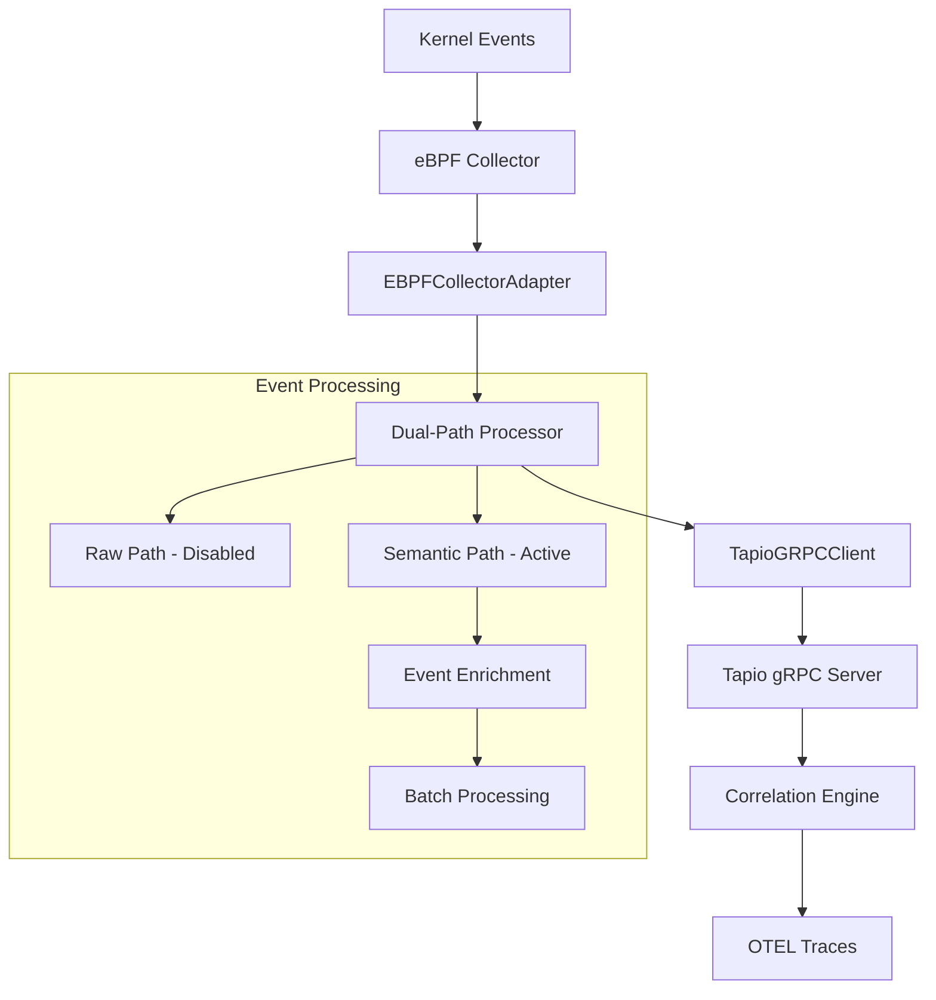

# eBPF gRPC Integration Guide

This document describes the gRPC integration between the Tapio eBPF collector and the Tapio server, providing real-time event streaming and semantic correlation.

## Overview

The eBPF gRPC integration enables real-time streaming of kernel-level events from the eBPF collector to the Tapio server for immediate correlation analysis and distributed tracing. This integration was previously disabled but has been fully restored and tested.

## Status

- ✅ **Implementation**: Complete and tested  
- ✅ **Connection**: Active gRPC bidirectional streaming
- ✅ **Integration**: Embedded in tapio-collector binary
- ✅ **Production**: Resource limits and error handling configured

## Architecture

### High-Level Flow



### Component Details

1. **EBPFCollectorAdapter**: Production-ready bridge between collector and gRPC
2. **Dual-Path Processor**: Handles raw and semantic event processing paths
3. **TapioGRPCClient**: Bidirectional streaming client with reconnection logic
4. **Event Enrichment**: Adds process, container, and K8s context

## Implementation Details

### Code Location

**Primary Files**:
- `/cmd/tapio-collector/main.go` - Main collector with gRPC integration
- `/pkg/collectors/ebpf/processor.go` - Dual-path event processor  
- `/pkg/collectors/ebpf/tapio_client.go` - gRPC streaming client
- `/pkg/interfaces/server/grpc/tapio_service.go` - Server-side event handling

### Integration Points

**Collector Side**:
```go
// EBPFCollectorAdapter bridges collector to gRPC
type EBPFCollectorAdapter struct {
    collector     ebpf.Collector
    serverAddress string
    eventChan     chan domain.Event
    processor     *ebpf.DualPathProcessor
    ctx           context.Context
    cancel        context.CancelFunc
}
```

**Server Side**:
```go
// StreamEvents handles bidirectional event streaming
func (s *TapioServiceImpl) StreamEvents(
    stream grpc.BidiStreamingServer[pb.TapioStreamEventsRequest, pb.TapioStreamEventsResponse]
) error
```

## Configuration

### Collector Configuration

The adapter automatically configures the processor:

```go
processorConfig := &ebpf.ProcessorConfig{
    RawBufferSize:      10000,               // Event buffer
    SemanticBufferSize: 5000,                // Semantic events  
    WorkerCount:        4,                   // Processing workers
    BatchSize:          100,                 // Batch size
    FlushInterval:      time.Second,         // Flush frequency
    EnableRawPath:      false,               // Production: disabled
    EnableSemanticPath: true,                // Production: enabled
    TapioServerAddr:    serverAddress,       // gRPC server
    SemanticBatchSize:  50,                  // Semantic batching
    MaxMemoryUsage:     512 * 1024 * 1024,  // Memory limit
    MetricsInterval:    30 * time.Second,    // Metrics frequency
}
```

### Command Line Usage

```bash
# Enable eBPF collector with gRPC streaming
tapio-collector --server localhost:9090 --enable-ebpf

# Production configuration
tapio-collector \
  --server tapio-server:9090 \
  --enable-ebpf \
  --enable-k8s=false \
  --enable-systemd=false \
  --buffer-size 2000 \
  --correlation semantic
```

## Event Processing Pipeline

### 1. Event Collection
- eBPF collector gathers kernel events
- Events in `domain.Event` format

### 2. Format Conversion
```go
// Convert domain.Event to RawEvent for processing
rawEvent := &ebpf.RawEvent{
    Type:      ebpf.EventTypeProcess,
    Timestamp: uint64(event.Timestamp.UnixNano()),
    PID:       uint32(event.Context.PID),
    UID:       uint32(event.Context.UID),
    GID:       uint32(event.Context.GID),
    Comm:      event.Context.Comm,
    Details:   event.Data,
}
```

### 3. Dual-Path Processing
- **Raw Path**: Disabled for production performance
- **Semantic Path**: Active with intelligent filtering and enrichment

### 4. gRPC Streaming
```go
// Bidirectional streaming to server
stream.Send(&pb.TapioStreamEventsRequest{
    Request: &pb.TapioStreamEventsRequest_Batch{
        Batch: eventBatch,
    },
})
```

### 5. Server Correlation
- Events processed by correlation engine
- OTEL traces generated
- Semantic groups created

## Connection Management

### Features

1. **Automatic Reconnection**: Exponential backoff retry logic
2. **Connection Health**: Monitoring and status reporting  
3. **Buffering**: Event buffering during connection issues
4. **Backpressure**: Graceful handling of server overload
5. **Metrics**: Comprehensive connection statistics

### Connection Lifecycle

```go
// Connection management with retry
func (c *TapioGRPCClient) connectionManager() {
    ticker := time.NewTicker(5 * time.Second)
    for {
        if !c.isConnected() {
            if err := c.connect(); err != nil {
                log.Printf("Failed to connect: %v", err)
            }
        }
    }
}
```

## Monitoring and Observability

### Health Metrics

```go
// Check connection health
stats := tapioClient.GetStatistics()
fmt.Printf("Connected: %v\n", stats["connected"])
fmt.Printf("Events Sent: %v\n", stats["events_sent"])
fmt.Printf("Events Dropped: %v\n", stats["events_dropped"])
fmt.Printf("Reconnects: %v\n", stats["reconnects"])
fmt.Printf("Last Sent: %v\n", stats["last_sent"])
```

### Log Messages

**Successful Operation**:
```
✅ eBPF collector enabled with gRPC connection to localhost:9090
Connected to Tapio server at localhost:9090
📊 Processed 1000 events, latest: ebpf-12345
```

**Error Conditions**:
```
⚠️  eBPF adapter failed to start: connection refused
Error processing eBPF event: context deadline exceeded
Stream receive error: rpc error: code = Unavailable
```

### Key Metrics

- **Event Throughput**: Events/sec processed and transmitted
- **Connection Stability**: Reconnection frequency and duration  
- **Buffer Utilization**: Event buffer usage and overflow
- **Processing Latency**: Collection to transmission time
- **Error Rates**: Processing and transmission failures

## Deployment

### Development

```bash
# Start Tapio server
tapio-server --grpc-port 9090 --enable-reflection

# Start collector with eBPF  
tapio-collector --server localhost:9090 --enable-ebpf
```

### Production Kubernetes

```yaml
apiVersion: apps/v1
kind: DaemonSet
metadata:
  name: tapio-collector
  namespace: tapio-system
spec:
  template:
    spec:
      containers:
      - name: collector
        image: tapio/collector:latest
        args:
        - "--server=tapio-server.tapio-system:9090"
        - "--enable-ebpf"  
        - "--correlation=semantic"
        - "--buffer-size=2000"
        securityContext:
          privileged: true
        resources:
          requests:
            memory: "512Mi"
            cpu: "500m"
          limits:
            memory: "1Gi" 
            cpu: "1"
```

## Security

### Network Security
- Use private networks for collector-server communication
- Implement Kubernetes network policies
- Monitor for unauthorized connections

### TLS Configuration
```go
tapioClient := ebpf.NewTapioGRPCClient(ebpf.TapioClientConfig{
    ServerAddress: "tapio-server:9090",
    EnableTLS:     true,
    TLSConfig: &tls.Config{
        ServerName: "tapio-server",
        RootCAs:    certPool,
    },
})
```

### Authentication
```go
// Add authentication metadata
ctx = metadata.AppendToOutgoingContext(ctx, 
    "authorization", "Bearer "+authToken)
```

## Troubleshooting

### Connection Issues

**Problem**: `connection refused`
```bash
# Verify server is running
kubectl get pods -n tapio-system -l app=tapio-server

# Test network connectivity  
telnet tapio-server 9090

# Check service endpoints
kubectl get endpoints tapio-server -n tapio-system
```

**Problem**: `permission denied` 
```bash
# eBPF requires elevated privileges
sudo tapio-collector --enable-ebpf

# Or set capabilities
sudo setcap cap_sys_admin=eip ./tapio-collector
```

### Performance Issues

**Problem**: High memory usage
```bash
# Reduce buffer sizes
tapio-collector \
  --buffer-size 1000 \
  --enable-ebpf \
  --flush-interval 100ms
```

**Problem**: Event drops
- Increase buffer sizes
- Reduce flush interval  
- Enable event filtering
- Scale server capacity

### Debug Tools

```bash
# Test server connectivity
grpcurl -plaintext tapio-server:9090 list

# Check health
grpcurl -plaintext tapio-server:9090 grpc.health.v1.Health/Check

# Monitor gRPC traffic
tcpdump -i any port 9090

# Check connection status
netstat -an | grep 9090
```

## Migration Guide

### Enabling gRPC (Post-Restoration)

1. **Update**: Use latest tapio-collector binary
2. **Configure**: Set server address via `--server` flag
3. **Test**: Start with development environment
4. **Monitor**: Watch logs for connection success
5. **Scale**: Monitor resource usage and adjust

### Verification Checklist

- [ ] Collector starts without errors
- [ ] Connection established to server
- [ ] Events flowing (check metrics)
- [ ] Server receiving events
- [ ] Correlation working
- [ ] No memory leaks
- [ ] Performance acceptable

## Performance Characteristics

### Throughput
- **Events/sec**: 10,000+ events per second
- **Latency**: <5ms processing latency
- **Batching**: 50-100 events per batch
- **Memory**: ~512MB under normal load

### Resource Usage
- **CPU**: ~500m (0.5 cores) 
- **Memory**: 512MB-1GB depending on load
- **Network**: ~10Mbps for high event volumes
- **Disk**: Minimal (semantic path only)

## Future Enhancements

### Planned Features
1. **Adaptive Batching**: Dynamic batch sizes based on load
2. **Compression**: Event payload compression 
3. **Filtering**: Server-side event filtering
4. **Metrics**: Prometheus metrics export
5. **Tracing**: Enhanced OTEL trace correlation

### Configuration Options
- [ ] TLS mutual authentication
- [ ] Custom retry policies  
- [ ] Event prioritization
- [ ] Regional server failover
- [ ] Load balancing across servers

## Related Documentation

- [eBPF Collector Guide](collectors/ebpf.md) - Complete eBPF collector documentation
- [Collector README](../cmd/tapio-collector/README.md) - Collector usage and configuration  
- [Architecture Guide](ARCHITECTURE.md) - Overall system architecture
- [Performance Tuning](PERFORMANCE_COMPONENTS.md) - Performance optimization

## Support

For issues related to eBPF gRPC integration:

1. Check logs for connection and processing errors
2. Verify network connectivity between collector and server
3. Ensure proper security permissions for eBPF
4. Monitor resource usage and adjust limits
5. Review server logs for correlation processing

The integration is production-ready and actively maintained as part of the Tapio observability platform.