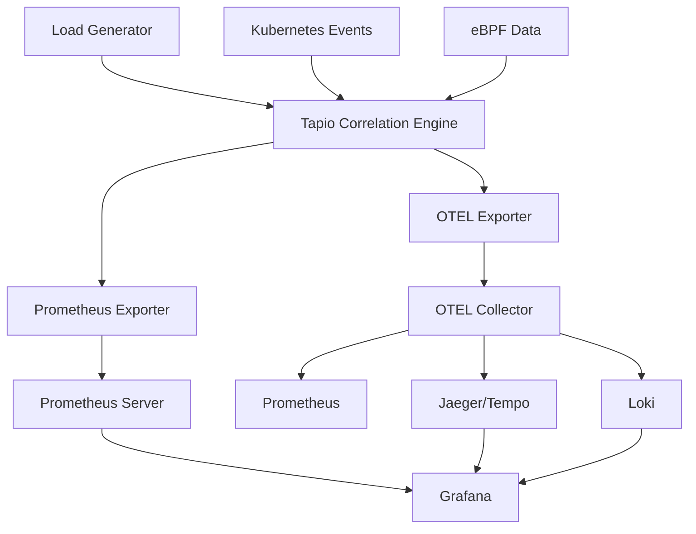

# Tapio Observability Integration Examples

This directory contains comprehensive examples demonstrating how to integrate Tapio's correlation engine with enterprise observability stacks using OTEL and Prometheus exports.

## 🏗️ Architecture Overview



## 🚀 Quick Start

### 1. Start the Complete Stack

```bash
# Clone and navigate to examples
cd examples/observability

# Start all observability components
docker compose up -d

# Verify services are running
docker compose ps
```

### 2. Access Dashboards

- **Grafana**: http://localhost:3000 (admin/admin)
- **Prometheus**: http://localhost:9090
- **Jaeger UI**: http://localhost:16686
- **Tapio Demo API**: http://localhost:8080

### 3. Generate Demo Data

```bash
# Generate sample correlations
curl http://localhost:8080/api/correlations/generate?count=10

# Validate patterns
curl http://localhost:8080/api/patterns/validate?type=memory_leak

# Check system health
curl http://localhost:8080/api/system/health?namespace=production
```

## 📊 Available Metrics

### Prometheus Metrics

```promql
# Correlation metrics
tapio_correlation_correlations_total
tapio_correlation_correlations_by_type_total
tapio_correlation_correlation_confidence
tapio_correlation_processing_time_seconds

# Pattern detection metrics
tapio_patterns_detected_total
tapio_patterns_accuracy
tapio_patterns_confidence
tapio_patterns_false_positives_total

# System health metrics
tapio_system_health_score
tapio_system_resource_usage_ratio
tapio_system_event_processing_rate

# Export performance metrics
tapio_export_latency_seconds
tapio_export_errors_total
```

### OTEL Traces

- **Correlation Analysis**: `tapio.correlation.analysis`
- **Event Processing**: `tapio.event.process`
- **Pattern Detection**: `tapio.pattern.detected`
- **Rule Execution**: `tapio.rule.execution`
- **Timeline Events**: `tapio.timeline.entry`

## 🔧 Configuration Examples

### OTEL Configuration

```go
config := &otel.ExporterConfig{
    ServiceName:     "tapio-correlation-engine",
    ServiceVersion:  "1.0.0",
    OTLPEndpoint:    "http://otel-collector:4318/v1/traces",
    SamplingRate:    1.0,
    BatchTimeout:    5 * time.Second,
    BatchSize:       100,
}

exporter, err := otel.NewExporter(config)
```

### Prometheus Configuration

```go
config := &prometheus.ExporterConfig{
    ListenAddress:         ":9091",
    MetricsPath:           "/metrics",
    EnableCustomCollector: true,
    EnableSystemMetrics:   true,
    EnablePatternMetrics:  true,
}

exporter, err := prometheus.NewExporter(config)
```

## 📈 Integration Patterns

### 1. Correlation to Trace Export

```go
// Export correlation with full tracing context
func ExportCorrelation(ctx context.Context, result *correlation.Result) error {
    // Create trace span
    ctx, span := tracer.Start(ctx, "correlation.analysis")
    defer span.End()
    
    // Add correlation attributes
    span.SetAttributes(
        attribute.String("correlation.rule_id", result.RuleID),
        attribute.String("correlation.severity", string(result.Severity)),
        attribute.Float64("correlation.confidence", result.Confidence),
    )
    
    // Export evidence as child spans
    for _, event := range result.Evidence.Events {
        exportEventSpan(ctx, event)
    }
    
    return nil
}
```

### 2. Real-time Metrics Export

```go
// Export correlation metrics immediately
func ExportMetrics(ctx context.Context, result *correlation.Result) error {
    labels := prometheus.Labels{
        "rule_id":   result.RuleID,
        "severity":  string(result.Severity),
        "category":  string(result.Category),
    }
    
    correlationsTotal.With(labels).Inc()
    correlationConfidence.With(labels).Observe(result.Confidence)
    
    return nil
}
```

### 3. Batch Processing

```go
// Process multiple correlations efficiently
func ProcessBatch(ctx context.Context, results []*correlation.Result) error {
    // Export traces in batch
    if err := otelExporter.ExportBatch(ctx, results); err != nil {
        return err
    }
    
    // Export metrics individually (Prometheus doesn't batch)
    for _, result := range results {
        if err := promExporter.ExportCorrelationResult(ctx, result); err != nil {
            log.Printf("Metric export failed: %v", err)
        }
    }
    
    return nil
}
```

## 🎯 Alerting Rules

### Prometheus Alerts

```yaml
groups:
  - name: tapio.rules
    rules:
      - alert: HighCriticalCorrelations
        expr: increase(tapio_correlation_correlations_total{severity="critical"}[5m]) > 10
        for: 2m
        labels:
          severity: critical
        annotations:
          summary: "High number of critical correlations detected"
          description: "{{ $value }} critical correlations in the last 5 minutes"
      
      - alert: LowPatternAccuracy
        expr: tapio_patterns_accuracy < 0.7
        for: 5m
        labels:
          severity: warning
        annotations:
          summary: "Pattern detection accuracy is low"
          description: "Pattern accuracy is {{ $value }}, below threshold of 0.7"
```

### Grafana Dashboards

The `grafana/` directory contains:

- **Tapio Overview**: High-level correlation and system health metrics
- **Pattern Analysis**: Detailed pattern detection performance
- **Export Performance**: OTEL and Prometheus export latency and errors
- **System Health**: Resource usage and entity health tracking

## 🧪 Testing and Validation

### Load Testing

```bash
# Start load generator
docker compose up load-generator

# Custom load patterns
curl -X POST http://localhost:8080/api/correlations/generate \
  -d '{"pattern": "memory_leak", "count": 100, "rate": "10/sec"}'
```

### Latency Validation

```bash
# Test export latency (should be <20ms)
curl -w "@curl-format.txt" http://localhost:8080/api/correlations
```

Create `curl-format.txt`:
```
     time_namelookup:  %{time_namelookup}\n
        time_connect:  %{time_connect}\n
     time_appconnect:  %{time_appconnect}\n
    time_pretransfer:  %{time_pretransfer}\n
       time_redirect:  %{time_redirect}\n
  time_starttransfer:  %{time_starttransfer}\n
                     ----------\n
          time_total:  %{time_total}\n
```

### Trace Validation

```bash
# Check traces in Jaeger
open http://localhost:16686

# Search for Tapio traces
# Service: tapio-correlation-engine
# Operation: tapio.correlation.analysis
```

## 🔍 Monitoring Export Health

### Key Metrics to Monitor

1. **Export Latency**: `tapio_export_latency_seconds`
2. **Export Errors**: `tapio_export_errors_total`
3. **Correlation Rate**: `rate(tapio_correlation_correlations_total[5m])`
4. **Pattern Accuracy**: `tapio_patterns_accuracy`

### Health Checks

```bash
# OTEL Collector health
curl http://localhost:13133

# Prometheus targets
curl http://localhost:9090/api/v1/targets

# Tapio demo health
curl http://localhost:8080/health
```

## 🛠️ Troubleshooting

### Common Issues

1. **No traces appearing in Jaeger**
   - Check OTEL Collector logs: `docker compose logs otel-collector`
   - Verify endpoint configuration in demo service

2. **Missing Prometheus metrics**
   - Check Prometheus targets: http://localhost:9090/targets
   - Verify metrics endpoint: http://localhost:9091/metrics

3. **High export latency**
   - Monitor OTEL Collector performance
   - Check network connectivity between services
   - Review batch configuration settings

### Debug Commands

```bash
# View all service logs
docker compose logs -f

# Check specific service
docker compose logs tapio-demo

# Restart services
docker compose restart otel-collector prometheus
```

## 📚 Integration Guides

- [Enterprise OTEL Setup](./docs/enterprise-otel.md)
- [Prometheus Federation](./docs/prometheus-federation.md)
- [Grafana Dashboard Setup](./docs/grafana-setup.md)
- [Custom Collector Development](./docs/custom-collectors.md)

## 🚀 Production Deployment

For production deployment, see:

- [Kubernetes Deployment](./k8s/)
- [Helm Charts](./helm/)
- [Security Configuration](./docs/security.md)
- [Performance Tuning](./docs/performance.md)