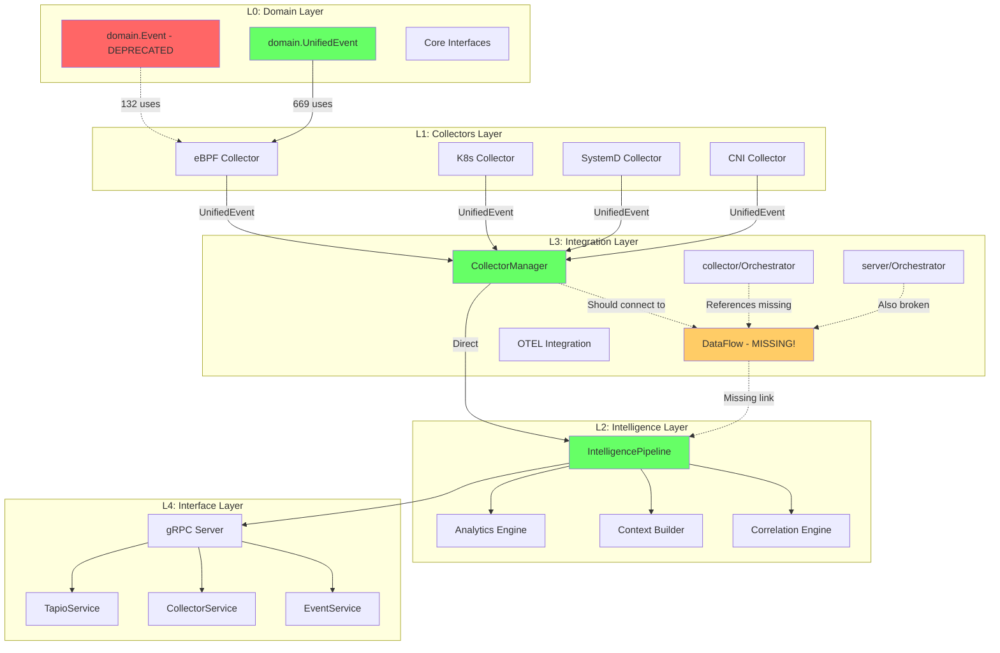
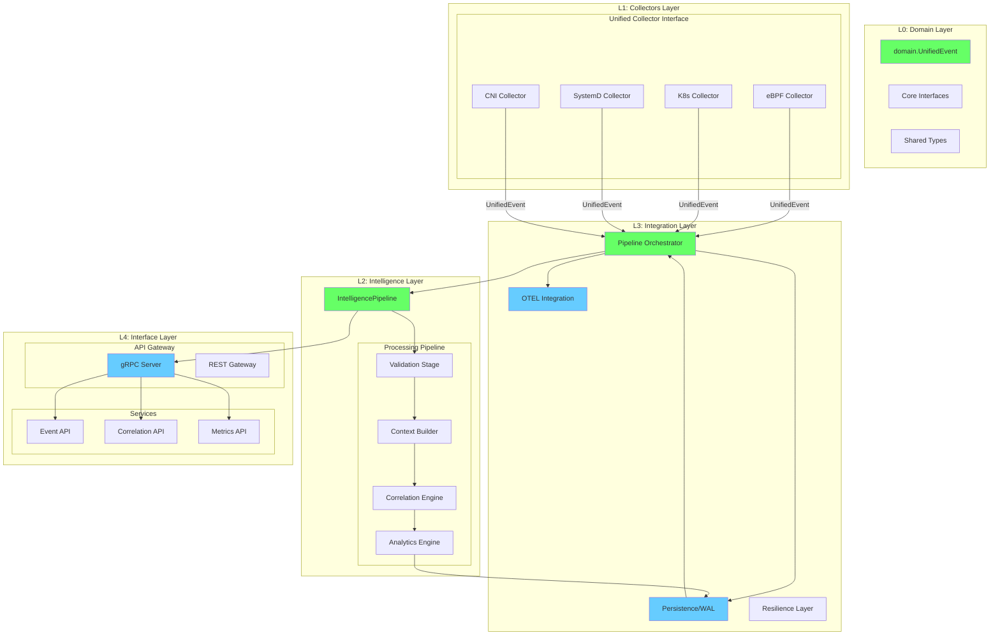
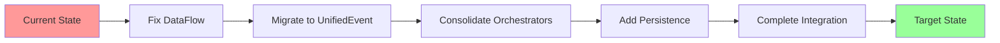
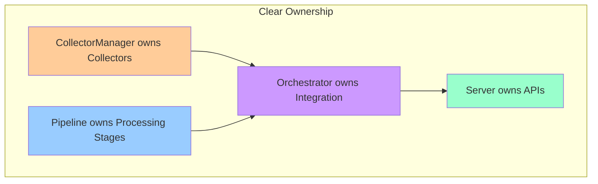

# Tapio Architecture Visual Diagram

## Current Architecture (AS-IS)

## Proposed Architecture (TO-BE)

## Key Improvements

### 1. Single Event Type
- Remove `domain.Event` completely
- All components use `domain.UnifiedEvent`
- No type conversions needed

### 2. Single Orchestration Point
- One `PipelineOrchestrator` in L3
- Manages collector lifecycle
- Handles pipeline integration
- Controls persistence

### 3. Clear Data Flow
- Collectors → Orchestrator → Pipeline → API
- No missing components
- No circular dependencies

### 4. Proper Layering
- L0: Pure domain types
- L1: Data collection
- L2: Intelligence/processing
- L3: Integration/orchestration
- L4: External interfaces

### 5. Added Components
- Persistence integration
- Resilience patterns
- REST gateway
- Proper metrics API

## Migration Path

## Component Relationships

